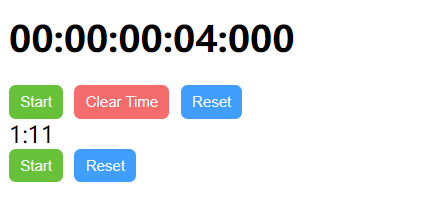

## 功能

1. 倒计时，通过组件传入的以 ms 为单位的倒计时，默认以 DD:HH:mm:ss:SSS 的形式呈现倒计时
2. 支持 start/pause 按钮，reset 按钮，clear time 按钮。当倒计时结束，只有 reset 按钮可用
3. 支持用户自定义显示倒计时的样式

## 所用到的技术方法

1. Date.now()方法
2. window.requestAnimationFrame()

通过组件传入的倒计时时间+当前 Date.now()，可以得到倒计时结束的时间戳 endTime。每次倒计时，不断比较当前的 Date.now()和 endTime，得到剩余倒计时 remainTime，再把 remainTime 绘制到页面上。重复如此，直至 Date.now()===endTime 3. 通过组合式函数和 ref，向父组件返回有状态的数据

## issues

1. 点击 reset 时，应当无视当前是否在计时状态，将时间固定到初始状态，将 stop 按钮的状态修正为 true

## 图例

## 代码仓库链接

https://github.com/LiufangHedy/myCountDown
